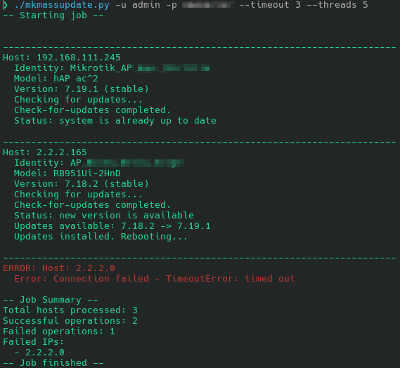

# MikroTik Mass Updater

This is a Python script to send commands to multiple Mikrotik devices via the API. It provides colored output (optional) and detailed logging.

This script builds on work already done by Phillip Hutchison and Kevin Byrd, ported to Python and the Mikrotik API by Gabriel Rolland, and further improved by other contributors.

**Key Features:**

*   **MikroTik API:** Uses the `librouteros` library to interact with the Mikrotik API, which is generally more efficient and provides more functionality than SSH.
*   **Concurrent operation:** Uses threads to connect to multiple devices simultaneously, significantly reducing the execution time. The number of threads can be adjusted using the `--threads` option to optimize performance based on your system's capabilities.
*   **Output grouped by host:** Results are clearly grouped by host, both on-screen and in the log file.
*   **Colored output (optional):** The on-screen output can be colored for better readability, highlighting hosts, commands, output, and errors. Colors can be turned on or off with the `--no-colors` command-line option.
*   **Detailed logging:** Logs all commands sent, output received, and errors encountered to a log file (`backuplog.txt`).
*   **Error handling:** The script handles connection errors, API errors, and other exceptions gracefully.
*   **Idempotent Update Logic:** Attempts to install updates regardless of the current status. Includes cases where status may be unclear or device already updated.
*   **Dry-run mode:** Allows to test the script and see the log output without actually installing updates using the `--dry-run` option.
*   **Configurable timeout:** Allows to change default timeout using the `--timeout` option.
*   **Custom Commands:** You can add custom commands to be executed on the Mikrotik devices directly within the `custom_commands` array in the script for tailored operations.

By default, the script checks for updates and installs them if the router does not refuse the operation.
The script will execute also the custom commands listed in `custom_commands` array.

## Requirements

*   **Python 3.6 or later**
*   **`librouteros` library:**

    ```bash
    pip install librouteros
    ```

    or

    ```bash
    sudo apt install python3-librouteros
    ```

## Notes

*   API access must be enabled on your Mikrotik devices (usually on port 8728).
*   The log file (`backuplog.txt`) is overwritten each time you run the script.
*   By default the script uses port 8728, otherwise you can specify the desired port `IP:port`.
*   Default timeout is 15 seconds, change it with `--timeout` option.

## Options

*   `-u` or `--username`: Specifies the API username. **(Required)**
*   `-p` or `--password`: Specifies the API password. **(Required)**
*   `-t` or `--threads`: Specifies the number of threads to use. Default is `10`.
*   `--timeout`: Specifies the connection timeout in seconds. Default is `15`.
*   `--no-colors`: Disables colored output on the screen.
*   `--dry-run`: Enables dry-run mode. Skips the actual installation of updates.
*   `--start-line`: Start from this line number in list.txt (1-based). Default is `1`.

## Usage

1. Download `mkmassupdate.py`
2. Install the `librouteros` library if it's not already installed
3. Edit or create the `list.txt` file with the IP addresses of your Mikrotik devices (one per line, in the format `IP` or `IP:port` if you are not using the default port 8728).
4. Edit the `custom_commands` array in `mkmassupdate.py` to add any custom commands you want to execute.
4. Run the script, providing your username and password as arguments:

    *   **With colors (default), specific timeout and dry-run mode:**

        ```bash
        python mkmassupdate.py -u your_username -p your_password --timeout 30 --dry-run
        ```

    *   **Without colors, with 20 threads:**

        ```bash
        python mkmassupdate.py --no-colors -u your_username -p your_password -t 20
        ```

    Replace `your_username` and `your_password` with your actual credentials.

## Usage Examples

```bash
# Start from line 100 in list.txt
python mkmassupdate.py -u admin -p password --start-line 100

# Resume from line 50 with dry-run enabled
python mkmassupdate.py -u admin -p password --start-line 50 --dry-run
```

## Custom Commands Format

The `custom_commands` array in the script supports two types of commands:

1. **Simple commands** - Just the command string:
   ```python
   '/interface/print'
   ```

2. **Commands with parameters** - A tuple containing the command and a dictionary of parameters:
   ```python
   ('/user/add', {
       'name': 'newuser',
       'password': 'userpass',
       'group': 'read'
   })
   ```

Example of custom_commands array:
```python
custom_commands = [
    # Simple command
    '/system/clock/print',
    
    # Command with parameters
    ('/user/add', {
        'name': 'monitor',
        'password': 'secret123',
        'group': 'read'
    }),
    
    # Another simple command
    '/user/print'
]
```

Note: Parameters must match the exact names expected by the MikroTik API for that command.

## Example `list.txt` file

The file supports three formats:
```
# 1. IP only (uses default port 8728 and default credentials)
192.168.1.1

# 2. IP with custom port
192.168.1.2:8729

# 3. IP[:port] with custom credentials (separated by |)
192.168.1.3|admin|password123
192.168.1.4:8729|admin|password123

# Lines starting with # are comments
# Empty lines are ignored
```

Note: Custom credentials are optional. If not specified, the credentials provided as command line parameters will be used.

## Screenshot


## Disclaimer

This script is provided as-is, without warranty of any kind. Use it at your own risk. Always test thoroughly in a non-production environment before deploying to production devices.