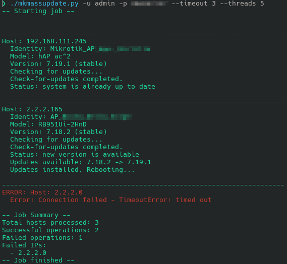

# MikroTik Mass Updater v5.0.5
This is a Python script to send commands to multiple Mikrotik devices via the API. It provides concurrent operations, detailed logging (seamlessly integrated with the progress bar), a formatted job summary, and configurable settings.

This script builds on work already done by Phillip Hutchison and Kevin Byrd, ported to Python and the Mikrotik API by Gabriel Rolland.

**Key Features:**

*   **MikroTik API:** Uses the `librouteros` library to interact with the Mikrotik API.
*   **Concurrent Operation:** Employs threading to connect to multiple devices simultaneously. The number of threads is configurable (`--threads`).
*   **Progress Bar:** Provides a visual progress bar (`tqdm`) to track the processing of hosts.
*   **Structured Logging:** Uses Python's standard `logging` module.
    *   Detailed logs are saved to a file in the `log` directory. Each run of the script generates a new log file with a timestamp in its name. File logs include timestamps, log levels, and thread names.
    *   Console output seamlessly integrates with the `tqdm` progress bar to prevent visual glitches, and includes optional color-coding for different log levels (`--no-colors` to disable).
    *   Debug mode for more verbose logging (`--debug`).
*   **Job Summary:** At the end of execution, a cleanly formatted visual summary is provided detailing total hosts processed, successful operations, and failed operations (including a list of specific failed IPs).
*   **SSL/TLS Support:** Optional SSL connections via the MikroTik API-SSL service. Configurable per-host (`|SSL` flag in the IP list) or globally (`--ssl` flag). Certificate verification is disabled to support MikroTik's self-signed certificates.
*   **Flexible Host Configuration:**
    *   IP list sourced from a file (default: `list.txt`, configurable via `--ip-list`).
    *   Supports `IP`, `IP:PORT`, `IP[:PORT]|USERNAME|PASSWORD`, and `IP[:PORT][|USERNAME|PASSWORD]|SSL` formats in the list file.
    *   Default API port is 8728 (or 8729 when SSL is enabled), configurable via `--port`.
*   **Error Handling:** Graceful handling of connection errors (`TimeoutError`, `socket.error`, `LibRouterosError`), API errors, and transient cloud backup issues, with intelligent retries for command execution. Malformed lines in the IP list are skipped with a warning.
*   **Update Logic:** Checks for and installs updates by default.
    *   `--dry-run` mode to simulate without actual installation.
    *   Configurable attempts and delay for update status checking (`--update-check-attempts`, `--update-check-delay`).
*   **Custom Commands (External):** Supports execution of user-defined custom commands loaded from an external YAML file (`--custom-commands`).
*   **Secure Password Input:** If the password is not provided via command-line, the script will securely prompt for it.
*   **Graceful Shutdown:** Handles `KeyboardInterrupt` (Ctrl+C) cleanly, attempting to stop operations and finalize.
*   **Start Line:** Option to start processing the IP list from a specific line number (`--start-line`).

## Requirements

*   **Python 3.6 or later**
*   **`librouteros` library:** (Tested with v3.4.1, other versions might work)
*   **`tqdm` library:** For the progress bar.
*   **`pyyaml` library:** For loading custom commands from YAML files.

    ```bash
    pip install librouteros tqdm pyyaml
    ```

    or on Debian/Ubuntu (for `librouteros` only, `tqdm` and `pyyaml` usually need pip):

    ```bash
    sudo apt install python3-librouteros
    pip install tqdm pyyaml
    ```

## Notes

*   API access (port 8728 by default, or 8729 for API-SSL) must be enabled on your Mikrotik devices. Use `--ssl` or the `|SSL` flag in the IP list for SSL connections.
*   The log file is created fresh each time the script is run with a timestamp.
*   Default connection timeout is 5 seconds (change with `--timeout`).

## Options

*   `-u USERNAME`, `--username USERNAME`: Specifies the API username. **(Required)**
*   `-p PASSWORD`, `--password PASSWORD`: Specifies the API password. If not provided, the script will securely prompt for it.
*   `-t THREADS`, `--threads THREADS`: Number of concurrent threads to use. Default: `5`.
*   `--timeout TIMEOUT`: Connection timeout in seconds for API communication. Default: `5`.
*   `--ip-list FILE_PATH`: Path to the IP list file. Default: `list.txt`.
*   `--port API_PORT`: Default API port if not specified in the IP list file. Default: `8728`.
*   `--update-check-attempts ATTEMPTS`: Number of attempts to check update status. Default: `15`.
*   `--update-check-delay DELAY`: Delay (seconds) between update status checks. Default: `2.0`.
*   `--no-colors`: Disables colored output on the console.
*   `--dry-run`: Enables dry-run mode (simulates updates but doesn't install).
*   `--start-line LINE_NUM`: Start from this line number in the IP list file (1-based). Default: `1`.
*   `--debug`: Enables debug logging level for more verbose output.
*   `--cloud-password PASSWORD`: Password for cloud backup. **(Required for performing cloud backup)**
*   `--upgrade-firmware`: Perform firmware upgrade.
*   `--ssl`: Enables SSL/TLS for all connections. When used, the default port switches to `8729` (API-SSL). SSL can also be enabled per-host by appending `|SSL` to entries in the IP list file.
*   `--custom-commands FILE_PATH`: Path to a YAML file containing custom commands to execute on each router.

## Usage

1.  Download or clone `mkmassupdate.py`.
2.  Install the required libraries (see "Requirements" section).
3.  Prepare your IP list file (default `list.txt`).
4.  (Optional) Create a `commands.yaml` file for custom commands (see "Custom Commands File Format" below).
5.  Run the script with your credentials and desired options:

    ```bash
    python3 mkmassupdate.py -u your_username [OPTIONS]
    ```

    **Examples:**

    *   **Basic run (will prompt for password):**
        ```bash
        python3 mkmassupdate.py -u admin
        ```

    *   **Using a custom IP list and 20 threads with password provided:**
        ```bash
        python3 mkmassupdate.py -u admin -p pass123 --ip-list /path/to/my_routers.txt -t 20
        ```

    *   **Dry run with increased timeout and debug logging, using custom commands:**
        ```bash
        python3 mkmassupdate.py -u admin --dry-run --timeout 30 --debug --custom-commands commands.yaml
        ```

    *   **Perform cloud backup with a specified password:**
        ```bash
        python3 mkmassupdate.py -u admin --cloud-password your_cloud_backup_password
        ```
    *   **Perform firmware upgrade:**
        ```bash
        python3 mkmassupdate.py -u admin --upgrade-firmware
        ```

    *   **Connect using SSL for all routers:**
        ```bash
        python3 mkmassupdate.py -u admin --ssl
        ```

## Custom Commands File Format

Custom commands are now loaded from an external YAML file specified by the `--custom-commands` argument. The file should contain a list of command definitions. Each command can be a simple string (for commands without parameters) or an object with `command` and `params` keys.

**Example `commands.yaml`:**

```yaml
# Example of custom commands
# Each item is a list containing [path, {parameter_dictionary}] or just [path]
- command: /system/clock/print
- command: /user/add
  params:
    name: newuser
    password: "secure_password_123"
    group: read
- command: /ip/firewall/filter/print
  params:
    "?chain": "input"
```

Note: Parameter names must match MikroTik API specifications.

### IP List File Format (list.txt or custom)

One entry per line. Supported formats:

*   **IP only** (uses default API port and script credentials)
    ```
    192.168.1.1
    ```

*   **IP with custom port**
    ```
    192.168.1.2:8729
    ```

*   **IP[:port] with custom credentials** (username|password)
    ```
    192.168.1.3|customuser|custompass
    192.168.1.4:8729|customuser2|custompass2
    ```

*   **IP with SSL** (auto-uses port 8729)
    ```
    192.168.1.5|SSL
    ```

*   **IP[:port] with custom credentials and SSL**
    ```
    192.168.1.6|admin|password123|SSL
    192.168.1.7:8730|admin|password123|SSL
    ```

*   **Lines starting with # are comments. Empty lines are ignored.**


## Screenshot


## Disclaimer

This script is provided as-is, without warranty of any kind. Use it at your own risk. Always test thoroughly in a non-production environment before deploying to production devices.
